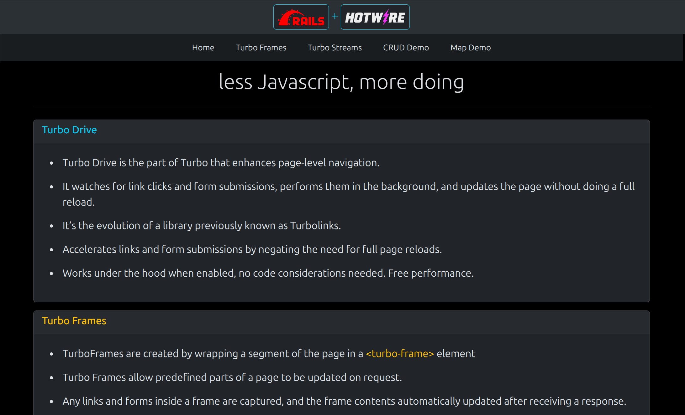
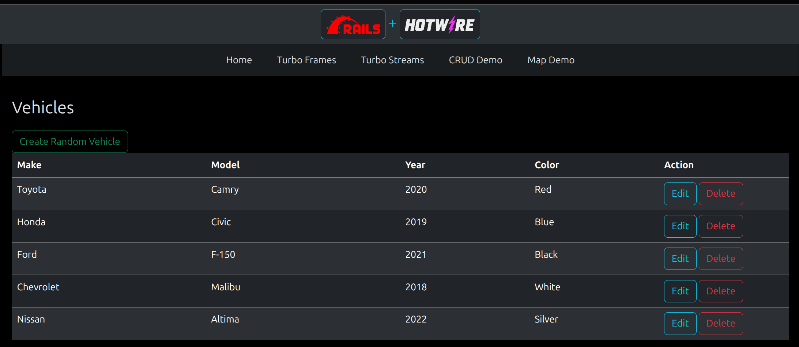
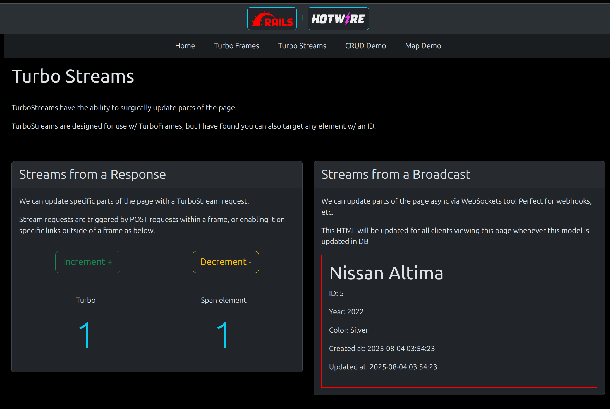

# Rails 7 + Hotwire Demo

This is a fun little demo I setup for a lightning-talk, and its nice for Turbo-beginners because it really flexes and isolates each feature of Turbo to get a better understanding. Feel free to clone it and play around with it!

